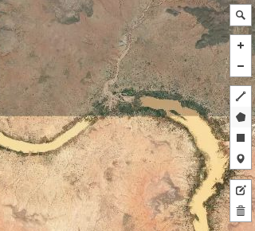
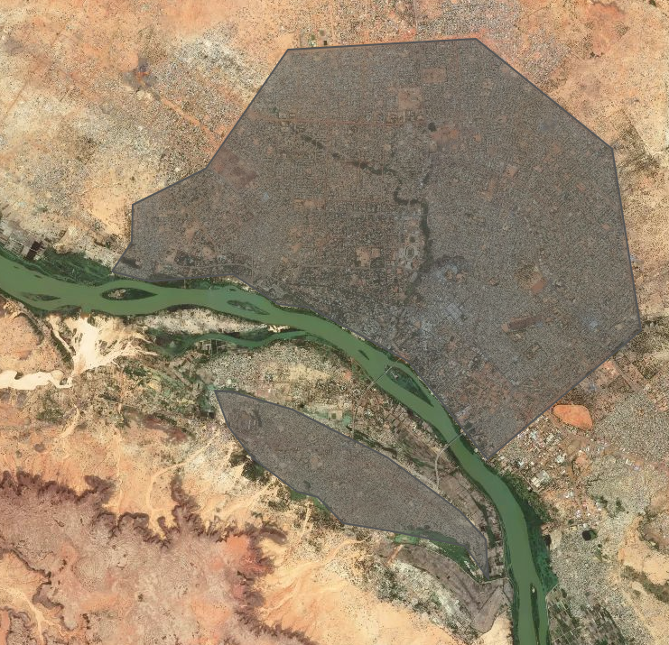
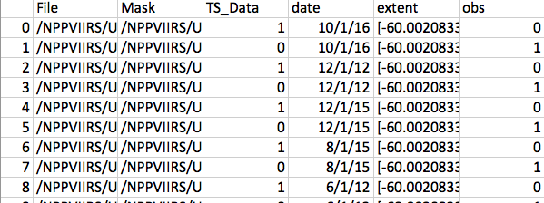
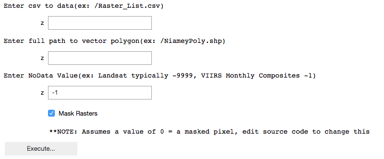
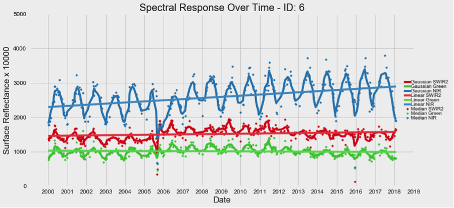

<h1 align="center">Comet Time Series (CometTS) Visualizer</h1>


<p align="center">


<a href="https://codecov.io/gh/CosmiQ/cometts"></a>
</p>

- [Installation Instructions](#installation-instructions)
- [Dependencies](#dependencies)
- [License](#license)
---


## About
The Comet Time Series tool is an open source IPython Notebook deployment that enables users to visualize a time series of satellite or potentially airborne imagery within a specific area. A user can input a time series raster dataset and a polygon vector file (i.e., shapefile or geojson) that contains an area or set of areas. Within each area, a .csv file will be output containing relevant statistics. A plot will also be produced to enable simple yet effective visualizations.

The first dataset we tested this tool with was [Suomii NPP VIIRS Nightlights Monthly Composite Data](https://ngdc.noaa.gov/eog/viirs/download_dnb_composites.html)  These data can be scraped easily using Firefox and the [DownThemAll](https://addons.mozilla.org/en-US/firefox/addon/downthemall/) AddOn. After download, the imagery will simply need to be unzipped using your tool of choice (i.e. WinRar or Mac Archive Utility) and formatted as described below.

Note that these data are incredibly large in size and may take considerable time (e.g., over a day) to download the whole dataset for the entire earth (i.e., ~1TB of data). Another option is downloading just 1/6th of the data for the earth.  Uncompressed, this will be about 200GB.

Check out the expansion pack & users guide for working with Landsat imagery [here.](https://github.com/CosmiQ/CometTS/blob/master/Landsat_Expansion_Docs_HelperScripts/Landsat_Expansion_CometTS_UsersGuide.docx)


## Installation
Python 2.7+, GDAL, and Jupyter Notebooks are the baseline requirements. The other requirements are listed in Requirements.txt and are easily installable via pip or conda.


    pip install -r Requirements.txt


## Dataset Organization
Data should be stored in a hierarchical folder pattern that is common for remote sensing applications.

    VIIRSData/
    └── Lat075N_Long060W
        ├── SVDNB_npp_20120401-20120430_75N060W_vcmcfg_v10_c201605121456
        │   ├── SVDNB_npp_20120401-20120430_75N060W_vcmcfg_v10_c201605121456.avg_rade9
        │   ├── SVDNB_npp_20120401-20120430_75N060W_vcmcfg_v10_c201605121456.cf_cvg
        ├── SVDNB_npp_20120501-20120531_75N060W_vcmcfg_v10_c201605121458
        │   ├── SVDNB_npp_20120501-20120531_75N060W_vcmcfg_v10_c201605121458.avg_rade9
        │   ├── SVDNB_npp_20120501-20120531_75N060W_vcmcfg_v10_c201605121458.cf_cvg.tif
        ├── SVDNB_npp_20120601-20120630_75N060W_vcmcfg_v10_c201605121459

        ...
        
    
If you are using non-VIIRS data, this pattern will remain consistent regardless. Data should be organized into exclusive areas with identical extents. The most important element of this structure is that images on different dates are stored in their own separate subdirectory. Mask bands should be stored in the same subdirectory as your time series data.
  
 
## Workflow Example

Run this command in a terminal before starting jupyter notebooks, you should only have to do this once:

```
jupyter nbextension enable --py widgetsnbextension
```

### Create Areas of Interest
After the raster data are organized appropriately, you are ready to begin a workflow. The secondary input is simply a polygon vector file which will direct your analysis and calculate the relevant statistics and plots. Polygons can be created in QGIS, the GIS software of your choice, or can be done online. One such way is going to  http://geojson.io/ and using the tool.

Simply select the polygon tool on the top right hand side of the screen.



You may want to switch to satellite imagery to easily identify features, then draw your areas of interest. You can select multiple areas from around the earth, or stick to one location. Be sure that the areas you are drawing fall within the bounds of your raster data. Save the data and you will be ready to work with the tool and generate your outputs. Figure A is an example of polygons drawn in Niamey, Niger. Plots and relevant statistics will be created for both of these polygons for the entire timespan of your raster data. 




After downloading the zipped geojson or shapefile, save it somewhere, open the IPython-notebook program (terminal > jupyter notebook) and then follow the instructions below. Ensure that the shapefile is in the same projection as your raster data! Otherwise it will appear the data are not overlapping and no statistics will be calculated!

### Create a CSV that documents your data structure
The process works by first iterating through the folder structure and creating a .csv file that indicates where each raster is stored, the date of each image, optionally the number of observations (if using monthly or annual composite data), and optionally a mask band for each of your time series raster images.

The CSV_Creator notebook creates the .csv input for you. You need to point the script to the appropriate place in your directory structure (The Lat075N_Long060W Folder from the above hierarchy graph.) From here, follow the instructions in the notebook. The script will use a filename character search pattern to pull out the appropriate files and, more importantly, the location of the date in your filename.

As an example, a file with the name S_VIIRS_20170407_XYZ.tif contains the date information within the filename in positions 8 through 16 in YMD format (2017, April 7th). Feeding "8:16" to the CSV_Creator script will pull out the relevant date information.

VIIRS monthly composite data has two bands that can be useful for time series analysis. The first documents the night-time brightness on the ground (S* rade9.tif) and the second documents the number of observations that contribute to each monthly composite (S* cvg.tif). The observation band can be used to plot the number of observations AND as a mask band. If there are 0 observations in a pixel for a month, that does not mean that brightness is 0, simply that there are no observations typically due to cloud cover. As such, these data should be masked out.


Here is the CSV structure:

An example input CSV is also distributed with this repository (Raster_List.csv).



#### Required columns:
File (Your time series data)

TS_Data (A binary listing indicating that a file is indeed part of your Time Series data and not an observation file)

date (The date of each time series observation extracted from the images filename)

#### Optional columns:
Mask (Your mask raster to mask out any anamolous pixels)

extent (The extent of your image- may be used in future iterations of the code)

obs (A binary listing indiciating whether a file is an observation band)

band (A band number- may be useful if working with multi-spectral imagery like Landsat)

### Analyze your Data
Open the Comet Time series Visualizer Notebook and run the top cell. Enter the location to your .csv that you created above, then to the path where your polygonised area of interest (AOI)  features are stored. Select if you have mask data you would like to use as well by checking or unchecking the checkbox.

The program assumes that your mask pixel value equals 0. You can modify this in the "Mask_It" function if your mask band has multiple values you would like to mask out, or simply a different value than 0. Additionally you should specify the no data value for your time series data. Landsat imagery has a no data value of -9999, and any negative value for VIIRS data is an acceptable no data value.

When your paths are set, click the “Execute…” button. This will then create the relevant statistics over time by iterating through your rasters. The amount of time this will take will depending upon the number of rasters and different AOIs you are analyzing at one time.





Once finished, the statistical data will be output in a .csv format and will allow for ingestion into other statistical software.  Alternatively, these data can be easily manipulated and plotted using the run_plot function and the final cell in the notebook. 

### Plot and Visualize your Data
This notebook offers some time series plotting functionality. It enables visualization and a first look evaluation that will allow for some basic conclusions to be drawn. Enhanced functionality can be acquired if using more sophisticated plotting tools, such as Plotly. For a deeper dive into the statistics, it is recommended you use a statistical analysis software like R.

## Example Output
The script will then run through and calculate the statistical central tendencies and amount of statistical spread present in the data over time. It will then plot this data and apply regression lines to it. Additionally, tabular data in a .csv format will be output in the same folder that contains your raster data. If you would like to test the plotting first, you can pull in the Multi_studyAreas_FullStats.csv that is distributed with this repo and use the last cell in the IPython notebook to visualize these data. 

#### Agadez, Niger

Seasonal variation in brightness that likely indicates seasonal migrations and population fluctuations in central Niger, Africa.


#### Suruc Refugee Camp, Turkey

Increase in brightness coinciding with the establishment of a refugee camp in southern Turkey, north of Syria.


#### Allepo, Syria

Brightness declines (i.e., putative population decline) as a result of Syrian Civil War and military actions in Aleppo.


#### NDVI Visualization north of Houston, Texas 

A visualization of the Normalized Difference Vegetation Index (NDVI) in a field north of Houston using a time-series of Landsat imagery.


## Landsat Expansion Pack

Extra code for working with Landsat imagery is now provided.  A users guide and helper scripts for aquiring Landsat imagery, organizing the data after download, and cloud masking that imagery is available in the [Landsat_Expansion_Docs_HelperScripts](https://github.com/CosmiQ/CometTS/tree/master/Landsat_Expansion_Docs_HelperScripts) folder.  Above we can see a time-series visualization of the Lower Ninth Ward in New Orleans from 2000-2018.  Note the affects of Hurricane Katrina on different multispectral bands in late 2005.

## Contribute or debug?
Interested in proposing a change, fixing a bug, or asking for help? Check out the [contributions](https://github.com/CosmiQ/CometTS/blob/master/CONTRIBUTING.MD) guidance.

## Dependencies
All dependencies can be found in the docker file [Dockerfile](./Dockerfile) or
[environment.yml](./environment.yml)

## License
See [LICENSE](./LICENSE.txt).

## Traffic


