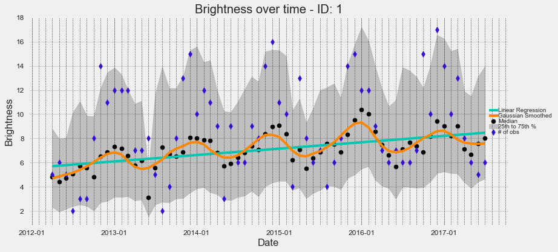
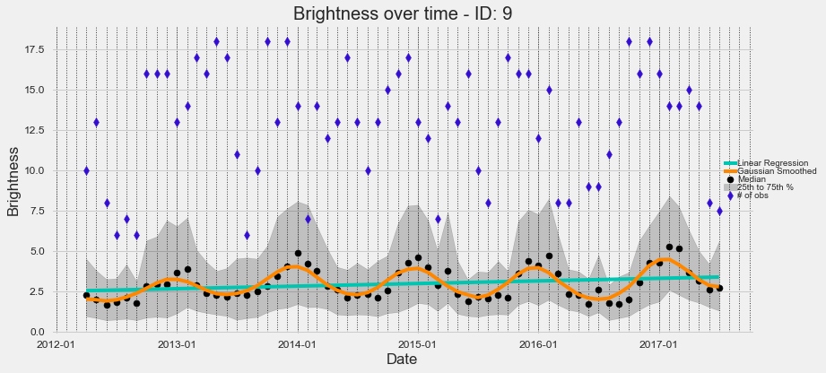
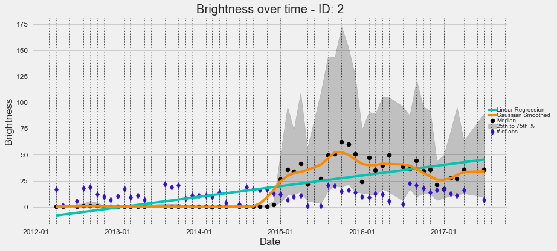
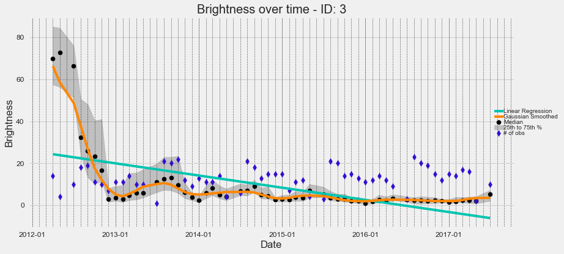
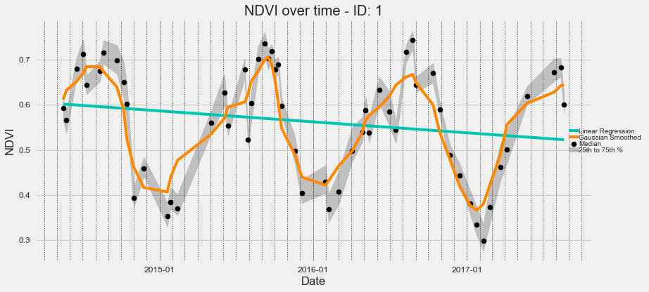

<h1 align="center">Comet Time Series (CometTS) Visualizer</h1>



<p align="center">


   


<a href="https://codecov.io/gh/cosmiq/cometts"></a>
</p>

- [Installation Instructions](#installation-instructions)
- [Dependencies](#dependencies)
- [License](#license)
---


## Base Functionality
Comet Time Series (``CometTS``) is an open source tool coded in python including jupyter notebooks and command line utility that enables users to visualize or extract relevant statistics from [almost any](https://gdal.org/drivers/raster/index.html) format time series of overhead imagery within a specific region of interest (ROI). To use ``CometTS``, you must define your ROI, provide a CSV file documenting how your imagery is organized, and then run one of the ``CometTS`` analysis tools. This usually takes the following steps

1. Outline and download your ROI with a service like [geojson.io](www.geojson.io)
2. Organize your imagery and document it with the [CometTS.CSV_It tool](https://github.com/CosmiQ/CometTS/blob/master/CometTS/CSV_It.py)
3. Analyze your data using:
   - [CometTS](https://github.com/CosmiQ/CometTS/blob/master/CometTS/CometTS.py) for trend analysis  (optionally, mask unwanted clouds and other features with [`--maskit` option](https://github.com/CosmiQ/CometTS/search?l=Python&q=--maskit))
   - or [CometTS.ARIMA](https://github.com/CosmiQ/CometTS/blob/master/CometTS/ARIMA.py) for averaging and anomaly detection
4. Plot the results using [the plotting notebook](Notebooks/Plot_Results.ipynb)

A full walkthrough of this functionality with example data is included in two notebooks: [CSV_Creator](Notebooks/CSV_Creator.ipynb) and [CometTS_Visualizer](Notebooks/CometTS_Visualizer.ipynb)

[Supported Raster Formats](https://gdal.org/drivers/raster/index.html)

[Supported Vector Formats](https://gdal.org/drivers/vector/index.html)

## Installation
Python 2.7 or 3.6 are the base requirements plus several packages.  ``CometTS`` can be installed in multiple ways including conda, pip, docker, and cloning this repository.


### Clone it
We recommend cloning to add all sample data and easier access to the jupyter notebooks that leverage our plotting functions.
```
git clone https://github.com/CosmiQ/CometTS.git
```
If you would like the full functionality of a python package we have several options.

### pip
```
pip install CometTS
```
pip installs may fail on macs with python3 as GDAL is finicky.  Use some of the alternative approaches below.

### Docker
```
docker pull jss5102/cometts
docker run -it -v /nfs:/nfs --name cometts jss5102/cometts /bin/bash 
```

### Conda
Create a conda environment!

```
git clone https://github.com/CosmiQ/CometTS.git
cd CometTS
conda env create -f environment.yml
source activate CometTS
pip install CometTS
```

### Dependencies
All dependencies can be found in the docker file [Dockerfile](./Dockerfile) or
[environment.yml](./environment.yml) or [requirements.txt](./requirements.txt).

## Examples

#### Agadez, Niger

Seasonal variation in brightness that likely indicates seasonal migrations and population fluctuations in central Niger, Africa.


#### Suruc Refugee Camp, Turkey

Increase in brightness coinciding with the establishment of a refugee camp in southern Turkey, north of Syria.


#### Allepo, Syria

Brightness declines (i.e., putative population decline) as a result of Syrian Civil War and military actions in Aleppo.


#### NDVI Visualization north of Houston, Texas

A visualization of the Normalized Difference Vegetation Index (NDVI) in a field north of Houston using a time-series of Landsat imagery.


#### Landsat Multispectral Visualization

A visualization of three Landsat bands in New Orleans, Louisiana.  Note the effects of Katrina in 2005.


## Contribute or debug?
Interested in proposing a change, fixing a bug, or asking for help? Check out the [contributions](https://github.com/CosmiQ/CometTS/blob/master/CONTRIBUTING.MD) guidance.


## License
See [LICENSE](./LICENSE).

## Traffic

